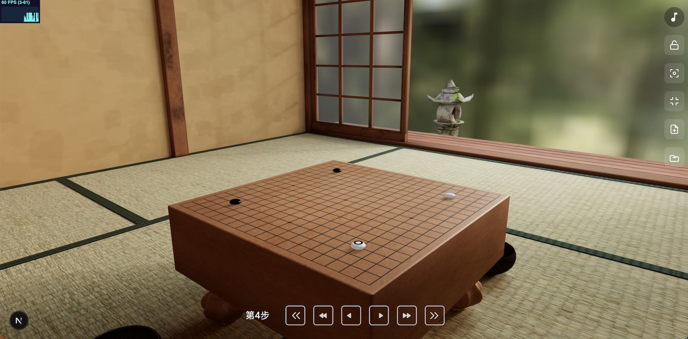

# Go 3D — 沉浸式围棋三维场景

> 个人项目 Demo · 日式和室中的 3D 围棋对弈与棋谱回放

[](https://go-3d-three.vercel.app/)


在榻榻米与庭园之间落子对弈。本项目将 **围棋规则引擎** 与 **高品质 WebGL 3D 渲染** 结合，主场景 `/` 可直接作为简历作品集展示。



## 在线体验

| | |
|---|---|
| **Live Demo** | [https://go-3d-three.vercel.app/](https://go-3d-three.vercel.app/) |
| **演示录屏** | 建议补充 30s GIF（落子 → 棋谱回放 → 视角切换），可放在 `docs/demo.gif` |

> 本地运行：`yarn install && yarn dev`，访问 [http://localhost:3000](http://localhost:3000)

## 30 秒看懂这个项目

1. 打开页面 → 日式 Loading → 相机动画推入和室
2. 默认加载一盘棋谱，可直接在 3D 棋盘上落子、提子
3. 底部栏逐步/跳步浏览棋谱；右侧栏切换视角、音效、全屏

## 技术亮点

| 亮点 | 说明 |
|------|------|
| **按需渲染** | `frameloop="demand"`，静止时不占 GPU；交互与动画时 `invalidate()` |
| **模型压缩** | 和室 GLB Draco 压缩至 ~8.9 MB，配合 `Preload` 预加载 |
| **围棋引擎** | 自研 19 路规则（提子、禁入点、打劫），含单元测试 |
| **3D 交互** | R3F + 射线检测落子、虚影预览、OrbitControls 与棋盘事件隔离 |
| **现代栈** | Next.js 15 · React 19 · R3F · Redux Toolkit · Tailwind CSS 4 |

## 技术栈

Next.js 15 · React 19 · Three.js · @react-three/fiber · @react-three/drei · Redux Toolkit · Tailwind CSS 4 · Vitest

## 快速开始

```bash
yarn install
yarn dev        # 开发
yarn build      # 生产构建（含 ESLint）
yarn test       # 围棋规则单元测试
yarn lint       # 代码检查
```

**环境要求：** Node.js 18+

## 主场景功能（`/`）

- 3D 和室场景（HDR 环境光 + 阴影）
- 19 路围棋盘：落子、提子、最后一手标记
- SGF 棋谱加载与逐步回放
- 相机：自由旋转、俯视、锁定、全屏
- 落子音效与背景音乐

## 项目结构（核心）

```
src/
├── app/page.tsx              # 主场景入口
├── components/
│   ├── go/Go.ts              # 围棋规则引擎（有测试）
│   ├── models/Board.tsx      # 3D 棋盘交互
│   └── models/Loader.tsx     # 首屏 Loading
├── hooks/useCameraAnimation.ts
└── data/sgf.ts               # 默认演示棋谱

public/
├── glb/room-baked.draco.glb  # Draco 压缩和室模型
├── hdri/                     # HDR 环境贴图
└── sound/                    # 落子音效
```

## 测试

围棋核心逻辑测试位于 `src/components/go/Go.test.ts`，覆盖：

- 基础落子
- 提子
- 禁入点
- 打劫

```bash
yarn test
```

## 部署建议

```bash
yarn build
# 推荐 Vercel 一键部署，构建命令 yarn build，输出 .next
```

Live Demo 已部署于 [https://go-3d-three.vercel.app/](https://go-3d-three.vercel.app/)。

## 更多（非 Demo 重点）

<details>
<summary>其他路由与扩展能力</summary>

| 路径 | 说明 |
|------|------|
| `/company` | 会议室场景 |
| `/sunset` | 日落户外场景 |
| `/backend` | iframe postMessage 通信 |

KataGo 集成、API 路由等见 [API_DOCUMENTATION.md](./API_DOCUMENTATION.md)。

</details>

## 许可证

个人学习项目（`private: true`）。如需公开展示，建议将仓库设为 Public 并补充 Live Demo 链接。
